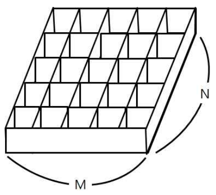

백준 7576번 토마토  
철수의 토마토 농장에서는 토마토를 보관하는 큰 창고를 가지고 있다. 토마토는 아래의 그림과 같이 격자 모양 상자의 칸에 하나씩 넣어서 창고에 보관한다.   
  
창고에 보관되는 토마토들 중에는 잘 익은 것도 있지만, 아직 익지 않은 토마토들도 있을 수 있다. 보관 후 하루가 지나면, 익은 토마토들의 인접한 곳에 있는 
익지 않은 토마토들은 익은 토마토의 영향을 받아 익게 된다. 하나의 토마토의 인접한 곳은 왼쪽, 오른쪽, 앞, 뒤 네 방향에 있는 토마토를 의미한다. 대각선 
방향에 있는 토마토들에게는 영향을 주지 못하며, 토마토가 혼자 저절로 익는 경우는 없다고 가정한다. 철수는 창고에 보관된 토마토들이 며칠이 지나면 다 익게 
되는지, 그 최소 일수를 알고 싶어 한다.  
토마토를 창고에 보관하는 격자모양의 상자들의 크기와 익은 토마토들과 익지 않은 토마토들의 정보가 주어졌을 때, 며칠이 지나면 토마토들이 모두 익는지, 그 최소 일수를 구하는 프로그램을 작성하라. 
단, 상자의 일부 칸에는 토마토가 들어있지 않을 수도 있다.  

입력형식  
첫 줄에는 상자의 크기를 나타내는 두 정수 M,N이 주어진다. M은 상자의 가로 칸의 수, N은 상자의 세로 칸의 수를 나타낸다. 단, 2 ≤ M,N ≤ 1,000 이다.  
둘째 줄부터는 하나의 상자에 저장된 토마토들의 정보가 주어진다. 즉, 둘째 줄부터 N개의 줄에는 상자에 담긴 토마토의 정보가 주어진다.  
하나의 줄에는 상자 가로줄에 들어있는 토마토의 상태가 M개의 정수로 주어진다. 정수 1은 익은 토마토, 정수 0은 익지 않은 토마토, 정수 -1은 토마토가 들어있지 않은 칸을 나타낸다.  
토마토가 하나 이상 있는 경우만 입력으로 주어진다.  
출력형식  
여러분은 토마토가 모두 익을 때까지의 최소 날짜를 출력해야 한다. 만약, 저장될 때부터 모든 토마토가 익어있는 상태이면 0을 출력해야 하고, 
토마토가 모두 익지는 못하는 상황이면 -1을 출력해야 한다.  

입력예제1  
6 4  
0 0 0 0 0 0  
0 0 0 0 0 0  
0 0 0 0 0 0  
0 0 0 0 0 1  
출력예제1  
8  
입력예제2  
6 4  
0 -1 0 0 0 0  
-1 0 0 0 0 0  
0 0 0 0 0 0  
0 0 0 0 0 1  
출력예제2  
-1  
입력예제3  
6 4  
1 -1 0 0 0 0  
0 -1 0 0 0 0  
0 0 0 0 -1 0  
0 0 0 0 -1 1  
출력예제3  
6  

키워드 : bfs를 이용하여 풀이할 수 있는 문제이다.  
2중 반복문을 통해 처음 토마토가 위치한 위치부터 시작해서 bfs를 진행하는데 상하좌우 범위를 벗어나지 않고 안익은 토마토가 있을 경우 queue에 삽입한다.  
처음 토마토는 1부터 시작해서 1일차 주변의 익은 토마토는 2로, 2일차 주변의 토마토는 3으로 하면서 현재 배열값에 +1을 해가면서 진행하고 값에 -1을 
한값이 날짜이다. (result라는 변수를 따로 만들지 않아도 됨)    
큐를 모두 비우고 나왔을 때 배열의 값중에 0이 있다면 토마토가 모두 익을수 없는 상황이기 때문에 -1을 return한다. 0이 없을 경우는 배열값 중에서 가장 
큰 값을 return한다.  

◎주의할점  
1. result라는 변수를 만들어서 큐에서 빼낼때 마다 값을 증가시키는 것이 아니라 현재 배열 값에 +1을 해가면서 저장한다.  
2. main문에서 처음 bfs문을 시작할 때 2중 반복문으로 배열을 순회할 때 토마토가 있으면 bfs를 실행하는 것이 아니라 처음에 queue에 삽입만 하고 결과는 모든 배열을 다 돌고나서 출력한다.

