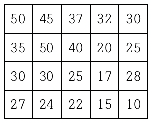
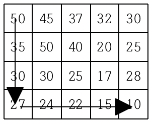
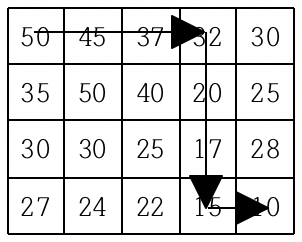
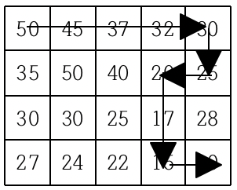

백준 1520번 내리막길  
여행을 떠난 세준이는 지도를 하나 구하였다. 이 지도는 아래 그림과 같이 직사각형 모양이며 여러 칸으로 나뉘어져 있다. 
한 칸은 한 지점을 나타내는데 각 칸에는 그 지점의 높이가 쓰여 있으며, 각 지점 사이의 이동은 지도에서 상하좌우 이웃한 곳끼리만 가능하다.  

  

현재 제일 왼쪽 위 칸이 나타내는 지점에 있는 세준이는 제일 오른쪽 아래 칸이 나타내는 지점으로 가려고 한다. 
그런데 가능한 힘을 적게 들이고 싶어 항상 높이가 더 낮은 지점으로만 이동하여 목표 지점까지 가고자 한다. 위와 같은 지도에서는 다음과 같은 세 가지 경로가 가능하다.  

    

지도가 주어질 때 이와 같이 제일 왼쪽 위 지점에서 출발하여 제일 오른쪽 아래 지점까지 항상 내리막길로만 이동하는 경로의 개수를 구하는 프로그램을 작성하시오.  

입력형식  
첫째 줄에는 지도의 세로의 크기 M과 가로의 크기 N이 빈칸을 사이에 두고 주어진다. 
이어 다음 M개 줄에 걸쳐 한 줄에 N개씩 위에서부터 차례로 각 지점의 높이가 빈 칸을 사이에 두고 주어진다. M과 N은 각각 500이하의 자연수이고, 각 지점의 높이는 10000이하의 자연수이다.  
출력형식  
첫째 줄에 이동 가능한 경로의 수 H를 출력한다. 모든 입력에 대하여 H는 10억 이하의 음이 아닌 정수이다.  

입력예제  
4 5  
50 45 37 32 30  
35 50 40 20 25  
30 30 25 17 28  
27 24 22 15 10  
출력예제  
3  

키워드 : 평소의 dfs처럼 풀이한다면 m과 n의 범위가 500까지이므로 시간초과가 발생한다.  
그렇기 때문에 한번 끝까지 이동했던 길은 dp를 이용하여 값을 가져다 사용하여 실행시간을 단축시킬 수 있다.  
상하좌우로 이동하면서 범위를 벗어나지 않고 더 낮은 지점이라면 dfs를 재귀호출하고 dp의 값을 0으로 초기화해준다.  
dfs를 재귀호출하며 인덱스가 마지막 인덱스까지 이동했다면 1을 리턴해주고 이전 인덱스의 dp값에 1을 더해준다.  
이차원 dp배열을 초기에 -1로 초기화 해준다. 이를 이용하여 dfs를 재귀호출 했을 때 dp의 값이 -1이 아니라면 끝까지 이동했던 길이므로 dp값을 리턴해준다.  

개인적으로 풀이를 참조하지 않고 풀었다면 못풀었을 것 같다. dfs만 생각했지만 입력의 범위가 충분히 클 경우에는 dp를 같이 활용하는 방법도 생각해야 될거 같다.