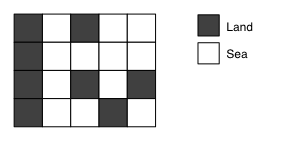

백준 4963번 섬의 개수  
정사각형으로 이루어져 있는 섬과 바다 지도가 주어진다. 섬의 개수를 세는 프로그램을 작성하시오.  
  
한 정사각형과 가로, 세로 또는 대각선으로 연결되어 있는 사각형은 걸어갈 수 있는 사각형이다.  
두 정사각형이 같은 섬에 있으려면, 한 정사각형에서 다른 정사각형으로 걸어서 갈 수 있는 경로가 있어야 한다. 지도는 바다로 둘러싸여 있으며, 지도 밖으로 나갈 수 없다.  

입력형식  
입력은 여러 개의 테스트 케이스로 이루어져 있다. 각 테스트 케이스의 첫째 줄에는 지도의 너비 w와 높이 h가 주어진다. w와 h는 50보다 작거나 같은 양의 정수이다.  
둘째 줄부터 h개 줄에는 지도가 주어진다. 1은 땅, 0은 바다이다.  
입력의 마지막 줄에는 0이 두 개 주어진다.  
출력형식  
각 테스트 케이스에 대해서, 섬의 개수를 출력한다.  

입력예제  
1 1  
0  
2 2  
0 1  
1 0  
3 2  
1 1 1  
1 1 1  
5 4  
1 0 1 0 0  
1 0 0 0 0  
1 0 1 0 1  
1 0 0 1 0  
5 4  
1 1 1 0 1  
1 0 1 0 1  
1 0 1 0 1  
1 0 1 1 1  
5 5  
1 0 1 0 1  
0 0 0 0 0  
1 0 1 0 1  
0 0 0 0 0  
1 0 1 0 1  
0 0  
출력형식  
0  
1  
1  
3  
1  
9  

키워드 : bfs를 이용하여 풀이할 수 있다.  
대각선으로도 이어진 섬으로 보고 있으므로 이동하는 배열인 dx와 dy를 대각선방향까지 총 8방향의 이동경로를 만들어준다.  
너비와 높이가 0, 0일 때 프로그램을 종료하므로 while문을 통해 조건을 만족할 때 반복문을 탈출하도록 설정한다.    
1. 이동했을 때의 좌표가 배열의 범위를 벗어나지 않는다.
2. 해당 좌표를 아직 방문하지 않았다.
3. 해당 좌표가 섬이다.  

위의 세가지를 모두 만족할 경우 dfs를 재귀호출하여 풀이한다.