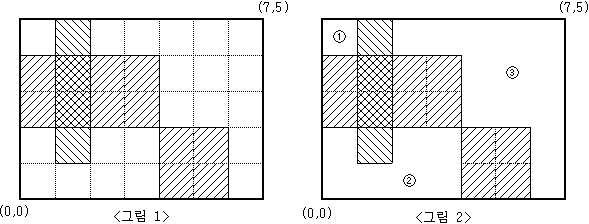

백준 2583번 영역 구하기  
눈금의 간격이 1인 M×N(M,N≤100)크기의 모눈종이가 있다. 이 모눈종이 위에 눈금에 맞추어 K개의 직사각형을 그릴 때, 이들 K개의 직사각형의 내부를 제외한 
나머지 부분이 몇 개의 분리된 영역으로 나누어진다.  
예를 들어 M=5, N=7 인 모눈종이 위에 <그림 1>과 같이 직사각형 3개를 그렸다면, 그 나머지 영역은 <그림 2>와 같이 3개의 분리된 영역으로 나누어지게 된다.  

  

<그림 2>와 같이 분리된 세 영역의 넓이는 각각 1, 7, 13이 된다.  
M, N과 K 그리고 K개의 직사각형의 좌표가 주어질 때, K개의 직사각형 내부를 제외한 나머지 부분이 몇 개의 분리된 영역으로 나누어지는지, 
그리고 분리된 각 영역의 넓이가 얼마인지를 구하여 이를 출력하는 프로그램을 작성하시오.  

입력형식  
첫째 줄에 M과 N, 그리고 K가 빈칸을 사이에 두고 차례로 주어진다. M, N, K는 모두 100 이하의 자연수이다.  
둘째 줄부터 K개의 줄에는 한 줄에 하나씩 직사각형의 왼쪽 아래 꼭짓점의 x, y좌표값과 오른쪽 위 꼭짓점의 x, y좌표값이 빈칸을 사이에 두고 차례로 주어진다. 
모눈종이의 왼쪽 아래 꼭짓점의 좌표는 (0,0)이고, 오른쪽 위 꼭짓점의 좌표는(N,M)이다. 입력되는 K개의 직사각형들이 모눈종이 전체를 채우는 경우는 없다.  
출력형식  
첫째 줄에 분리되어 나누어지는 영역의 개수를 출력한다. 둘째 줄에는 각 영역의 넓이를 오름차순으로 정렬하여 빈칸을 사이에 두고 출력한다.  

입력예제  
5 7 3  
0 2 4 4  
1 1 2 5  
4 0 6 2  
출력예제  
3  
1 7 13  

키워드 : dfs를 이용하여 풀이할 수 있다. 상하좌우로 이동하며 이동가능 여부를 체크하므로 이동하는 배열과 방문여부를 확인하는 배열을 생성한다.  
입력으로 주어지는 직사각형의 왼쪽 아래 꼭짓점과 오른쪽 위 꼭짓점 만큼 반복문을 통해 -1로 채워준다.  
배열의 값이 -1이 아니고 방문하지 않은 위치라면 dfs를 호출하고 이동한 칸의 수를 카운트 하기 위해 변수를 하나씩 증가 시키며 재귀호출한다.  
처음의 재귀호출을 전부 실행했을 때 카운트 값을 ArrayList에 넣고 다시 0으로 초기화 한후 다음 위치에서 조건을 만족할 때 dfs를 호출한다.  
ArrayList값을 정렬한 후 ArrayList의 크기와 원소값을 출력한다.