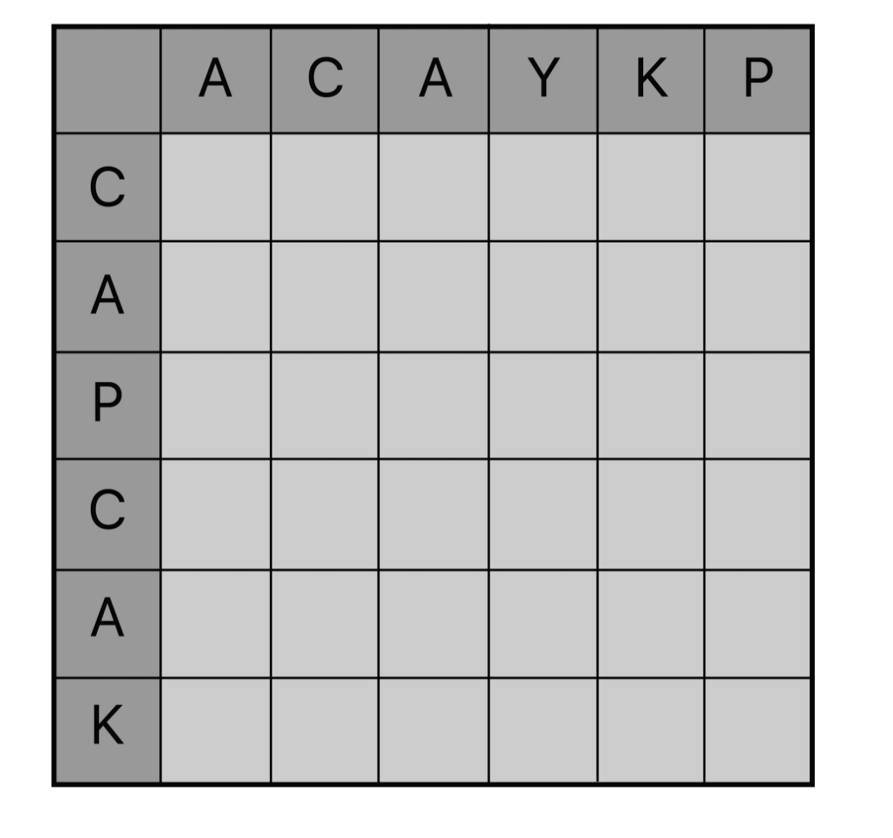
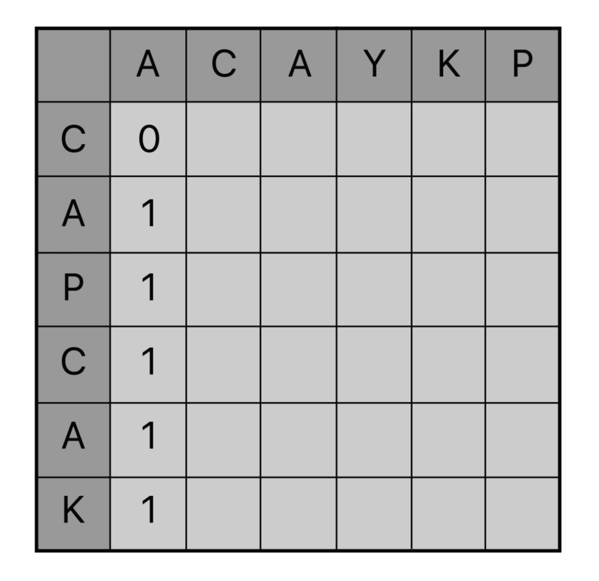
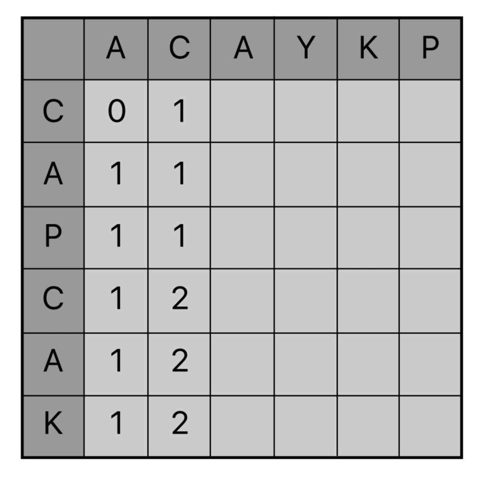
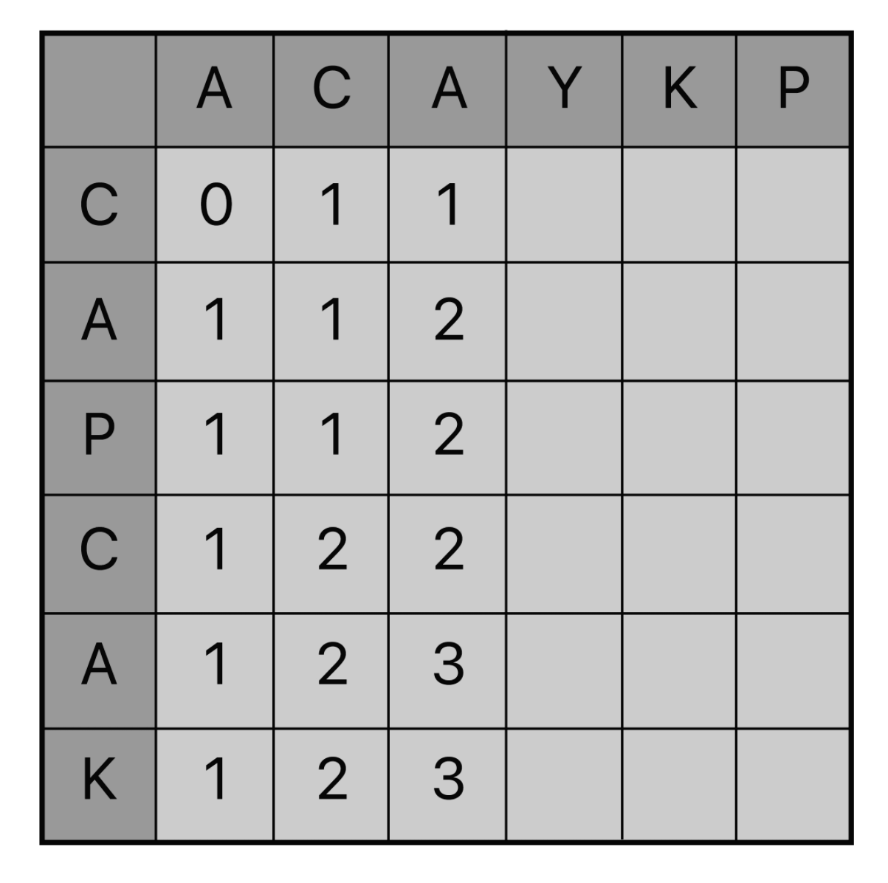
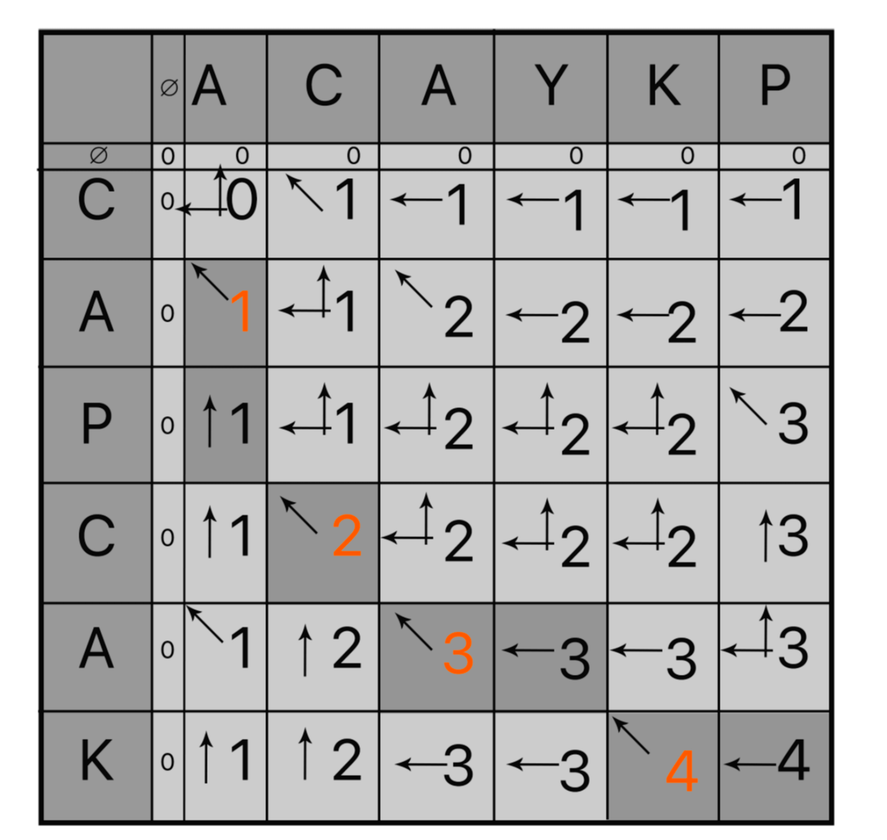

백준 9251번 LCS  
LCS(Longest Common Subsequence, 최장 공통 부분 수열)문제는 두 수열이 주어졌을 때, 모두의 부분 수열이 되는 수열 중 가장 긴 것을 찾는 문제이다.  
예를 들어, ACAYKP와 CAPCAK의 LCS는 ACAK가 된다.  

입력형식  
첫째 줄과 둘째 줄에 두 문자열이 주어진다. 문자열은 알파벳 대문자로만 이루어져 있으며, 최대 1000글자로 이루어져 있다.  
출력형식  
첫째 줄에 입력으로 주어진 두 문자열의 LCS의 길이를 출력한다.  

입력예제  
ACAYKP  
CAPCAK  
출력예제  
4  

키워드 : DP를 이용하여 풀이할 수 있다.  
입력된 문자열을 가로축 세로축으로 하는 표를 만들어 하나씩 비교하면서 같을 경우 1씩 증가시키는 누적합 방식을 이용하여 풀이한다.  
예를 들어 문자열이 ACAYKP, CAPCAK 두개가 주어진다고 한다면 아래와 같이 표를 생성한다.  
  

첫번째 열의 문자부터 하나씩 비교해나가면서 공통 수열을 갖는다면 공통 수열의 길이만큼 누적해나간다.
첫번째 문자는 {A}이므로 두번째 행에서 A를 만날때 1의 값을 갖고 누적해나간다.  
  

다음의 열의 문자는 {C}이므로 수열은 {A,C}이다. 첫번째 행에서 C를 만나서 1의 값을 누적한다.  
이어나가다가 4번째 행에서 {C}를 만나고 {C,A,P,C}수열에서 {A,C}를 가지므로 1을 누적하여 2의 값을 갖는다.  
  

다음 3열의 문자는 {A}이므로 수열은 {A,C,A}이다. 첫번째 행에서 {C}를 만나서 1을 누적하고 두번째 행에서 {C,A}를 만났으므로 1을 다시 누적하여 2의 값을 갖는다. 
이어나가다가 5번째 행에서 {A}를 만나고 {C,A,P,C,A}수열에서 {A,C,A}를 가지므로 1을 누적하여 3의 값을 갖는다.  
  

  
이러한 규칙으로 표를 채워나갈 수 있고 표를 채워나갈때 열의 문자와 행의 문자가 같을 경우 배열[행-1][열-1] + 1이 되는 규칙이 있다.  
문자가 같지 않을 경우에는 이전의 행 또는 이전의 열 값중에서 더 큰값을 가져온다. => 배열[행-1][열]과 배열[행][열-1]중 더 큰값  
이러한 규칙을 통해 점화식을 세워 DP를 이용하여 문제를 풀이할 수 있다.