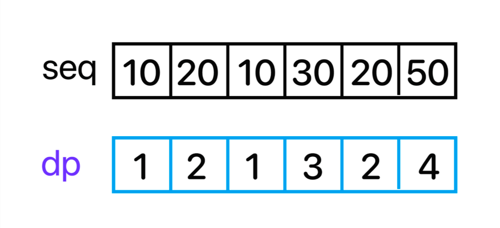

백준 11053번 가장 긴 증가하는 부분 수열  
수열 A가 주어졌을 때, 가장 긴 증가하는 부분 수열을 구하는 프로그램을 작성하시오.  
예를 들어, 수열 A = {10, 20, 10, 30, 20, 50} 인 경우에 가장 긴 증가하는 부분 수열은 A = {10, 20, 10, 30, 20, 50} 이고, 길이는 4이다.  

입력형식  
첫째 줄에 수열 A의 크기 N (1 ≤ N ≤ 1,000)이 주어진다.  
둘째 줄에는 수열 A를 이루고 있는 Ai가 주어진다. (1 ≤ Ai ≤ 1,000)  
출력형식  
첫째 줄에 수열 A의 가장 긴 증가하는 부분 수열의 길이를 출력한다.  

입력예제  
6  
10 20 10 30 20 50  
출력예제  
4  

키워드 : DP를 이용하여 풀이할 수 있다. 탐색하려는 위치를 기준으로 이전의 위치에서 값을 비교하고 길이를 비교하면서 풀이할 수 있다.  

   
1. 현재 인덱스에서 값이 이전 인덱스 값보다 크고 
2. 해당 인덱스에서 dp값이 이전 인덱스 dp값보다 작으면 이전 인덱스의 길이값에 +1한 값을 저장한다.  

위와 같은 조건을 통해 dp 배열을 채울 수 있고 dp배열 중 최댓값을 뽑아와 결과를 출력할 수 있다.