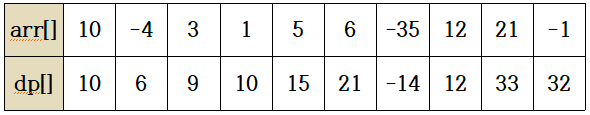

백준 1912번 연속합  
n개의 정수로 이루어진 임의의 수열이 주어진다. 우리는 이 중 연속된 몇 개의 수를 선택해서 구할 수 있는 합 중 가장 큰 합을 구하려고 한다.  
단, 수는 한 개 이상 선택해야 한다. 예를 들어서 10, -4, 3, 1, 5, 6, -35, 12, 21, -1 이라는 수열이 주어졌다고 하자.  
여기서 정답은 12+21인 33이 정답이 된다.  

입력형식  
첫째 줄에 정수 n(1 ≤ n ≤ 100,000)이 주어지고 둘째 줄에는 n개의 정수로 이루어진 수열이 주어진다. 수는 -1,000보다 크거나 같고, 1,000보다 작거나 같은 정수이다.  
출력형식  
첫째 줄에 답을 출력한다.  

입력예제1    
10  
10 -4 3 1 5 6 -35 12 21 -1  
출력예제1  
33  
입력예제2    
5  
-1 -2 -3 -4 -5  
출력예제2  
-1  

키워드 : DP를 이용하여 풀 수 있다.  
이전부터 계속 연속한 값 vs 현재부터 연속된 값을 비교하여 더 큰값을 저장해 나가면서 풀이할 수 있다.
주어진 배열과 크기가 같은 dp배열을 하나 생성한다. dp배열의 첫번째 원소의 값은 주어진 배열의 첫번째 원소값을 저장한다.  
그후 주어진 배열을 순회하면서 주어진 배열의 값과 dp배열의 이전값 + 주어진 배열의 값중에서 큰값을 dp배열에 저장해 나간다.  
    
위의 그림과 같이 dp[i-1] + array[i]의 값보다 array[i]의 값이 더크다면 array[i]값을 저장한다.  
=> 이전부터 연속된 값보다 현재부터 다시 시작하는 값이 더 크기때문에 여기서 부터 연속해서 다시 저장하는게 가장 큰 수를 만들 수 있기 때문이다.  
이와 같이 dp배열을 생성하고 그 중 가장 큰값을 출력한다.

