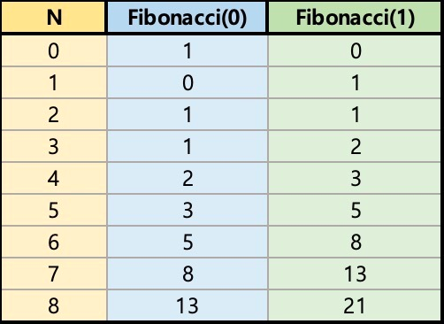

백준 1003번 피보나치 함수  
다음 소스는 N번째 피보나치 수를 구하는 C++ 함수이다.
```
int fibonacci(int n) {
    if (n == 0) {
        printf("0");
        return 0;
    } else if (n == 1) {
        printf("1");
        return 1;
    } else {
        return fibonacci(n‐1) + fibonacci(n‐2);
    }
}
```

fibonacci(3)을 호출하면 다음과 같은 일이 일어난다.

fibonacci(3)은 fibonacci(2)와 fibonacci(1) (첫 번째 호출)을 호출한다.  
fibonacci(2)는 fibonacci(1) (두 번째 호출)과 fibonacci(0)을 호출한다.  
두 번째 호출한 fibonacci(1)은 1을 출력하고 1을 리턴한다.  
fibonacci(0)은 0을 출력하고, 0을 리턴한다.  
fibonacci(2)는 fibonacci(1)과 fibonacci(0)의 결과를 얻고, 1을 리턴한다.  
첫 번째 호출한 fibonacci(1)은 1을 출력하고, 1을 리턴한다.  
fibonacci(3)은 fibonacci(2)와 fibonacci(1)의 결과를 얻고, 2를 리턴한다.  
1은 2번 출력되고, 0은 1번 출력된다. N이 주어졌을 때, fibonacci(N)을 호출했을 때, 0과 1이 각각 몇 번 출력되는지 구하는 프로그램을 작성하시오.  

입력형식  
첫째 줄에 테스트 케이스의 개수 T가 주어진다.  
각 테스트 케이스는 한 줄로 이루어져 있고, N이 주어진다. N은 40보다 작거나 같은 자연수 또는 0이다.  
출력형식  
각 테스트 케이스마다 0이 출력되는 횟수와 1이 출력되는 횟수를 공백으로 구분해서 출력한다.  

입력예제1  
3  
0  
1  
3  
출력예제1  
1 0  
0 1  
1 2  
입력예제2  
2  
6  
22  
출력예제2  
5 8  
10946 17711  

키워드 : 시간제한이 0.25초인 문제로 일반적인 재귀함수나 반복문을 통하여 답을 구하려고 하면 시간초과가 나올 것이다.  
답을 저장할 배열이나 변수를 생성해서 하나씩 호출할 때마다 중복되는 값은 다시 호출하는 것이 아니라 저장된 배열이나 변수값을 그대로 가져와서 사용한다.  

------------------------------------------------------------------------------------------------------------------------------------

재귀함수 풀이  
0의 호출 수와 1의 호출 수를 저장할 이차원 배열을 하나 생성한다. 배열을 모두 0으로 채워넣는다.  
n이 0일 경우와 1일 경우는 0의 호출 수와 1의 호출 수의 값이 규칙없이 정해져 있기 때문에 저장해둔다.  
0의 호출 수와 1의 호출 수의 배열 값이 -1일 경우 한번도 사용하지 않은 배열이므로 fibonacci(x-1) + fibonacci(x-2)를 재귀호출하고 값을 저장한다.  
0의 호출 수와 1의 호출 수의 배열 값이 -1이 아닐 경우 해당 값을 호출한 적이 있는 경우 이므로 재귀호출을 하지 않고 값을 그대로 가져다 쓴다.  
이를 통해 반복되는 값을 다시 호출하는 과정을 하지 않으므로 시간적효율이 좋다.  
원하는 n의 값일 때까지 재귀호출을 모두 진행했다면 n일때의 2차원 배열 값을 출력한다.  

------------------------------------------------------------------------------------------------------------------------------------

반복문 풀이  
반복되는 규칙을 통해 풀이 할 수 있다.  
  
이와 같이 N의 fibonacci(0)은 N-1의 fibonacci(1)값이다. N의 fibonacci(1)은 N-1의 fibonacci(0) + fibonacci(1)값이다.  
이러한 규칙을 통해 알맞은 변수를 생성하고 n까지 반복하면서 fibonacci(0)의 값과 fibonacci(1)의 값을 저장해나간다.  
원하는 n의 값까지 반복했다면 n일때 저장해둔 변수의 값을 출력한다.  

