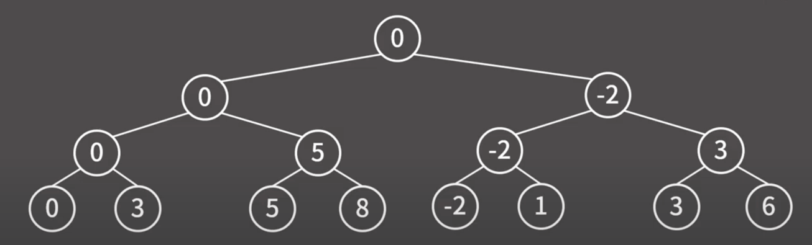

백준 1182 부분수열의 합  
N개의 정수로 이루어진 수열이 있을 때, 크기가 양수인 부분수열 중에서 그 수열의 원소를 다 더한 값이 S가 되는 경우의 수를 구하는 프로그램을 작성하시오.  

입력형식  
첫째 줄에 정수의 개수를 나타내는 N과 정수 S가 주어진다. (1 ≤ N ≤ 20, |S| ≤ 1,000,000) 둘째 줄에 N개의 정수가 빈 칸을 사이에 두고 주어진다.   
주어지는 정수의 절댓값은 100,000을 넘지 않는다.  
출력형식  
첫째 줄에 합이 S가 되는 부분수열의 개수를 출력한다.  

입력예제  
5 0  
-7 -3 -2 5 8  
출력예제  
1  

키워드 : 백트래킹으로 해결가능하다.  
ex)주어진 데이터 -2, 5, 3일 경우  
  
위의 그림과 같이 주어진 데이터 값을 하나씩 탐색하면서 포함하거나 미포함해가면서 S와 비교하면서 구할 수 있다.  
재귀호출할 때 해당 깊이의 데이터를 포함하는 재귀호출과 해당 깊이의 데이터를 포함하지 않는 재귀호출을 통해 모든 경우의 수를 확인할 수 있다.  
