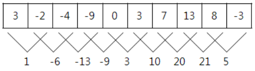
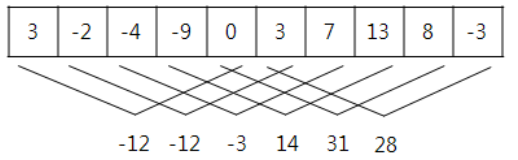
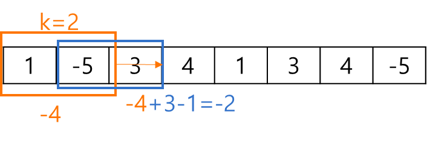

백준 2559번 수열  
매일 아침 9시에 학교에서 측정한 온도가 어떤 정수의 수열로 주어졌을 때, 연속적인 며칠 동안의 온도의 합이 가장 큰 값을 알아보고자 한다.  
예를 들어, 아래와 같이 10일 간의 온도가 주어졌을 때,  
3 -2 -4 -9 0 3 7 13 8 -3  
모든 연속적인 이틀간의 온도의 합은 아래와 같다.  
  
이때, 온도의 합이 가장 큰 값은 21이다.  또 다른 예로 위와 같은 온도가 주어졌을 때, 모든 연속적인 5일 간의 온도의 합은 아래와 같으며,  
  
이때, 온도의 합이 가장 큰 값은 31이다. 매일 측정한 온도가 정수의 수열로 주어졌을 때, 연속적인 며칠 동안의 온도의 합이 가장 큰 값을 계산하는 프로그램을 작성하시오.  

입력형식  
첫째 줄에는 두 개의 정수 N과 K가 한 개의 공백을 사이에 두고 순서대로 주어진다. 첫 번째 정수 N은 온도를 측정한 전체 날짜의 수이다.   
N은 2 이상 100,000 이하이다. 두 번째 정수 K는 합을 구하기 위한 연속적인 날짜의 수이다. K는 1과 N 사이의 정수이다.   
둘째 줄에는 매일 측정한 온도를 나타내는 N개의 정수가 빈칸을 사이에 두고 주어진다. 이 수들은 모두 -100 이상 100 이하이다.  
출력형식  
첫째 줄에는 입력되는 온도의 수열에서 연속적인 K일의 온도의 합이 최대가 되는 값을 출력한다.  

입력예제1  
10 2  
3 -2 -4 -9 0 3 7 13 8 -3  
출력예제1  
21  
입력예제2  
10 5  
3 -2 -4 -9 0 3 7 13 8 -3  
출력예제2  
31  

키워드 : 입력값 N이 100_000까지 이므로 2중 for문을 이용해 풀이한다면 O(N^2)의 시간복잡도가 나오게 되고 시간초과가 발생할 것이다.  
그렇기 때문에 총 세가지의 방법으로 문제를 풀이할 것이다.  

------------------------------------------------------------------------------------------------------------------------  

1.누적합  
인덱스 1부터 시작해 반복문을 통해서 앞의 인덱스의 누적합 배열에 현재 인덱스 입력배열을 더해서 누적합 배열을 완성시킨다.  
누적합을 이용해서 연속된 특정 구간에서의 합을 구할 때는 현재 누적합 배열 - 현재에서 원하는 구간의 크기를 뺀 누적합 배열로 얻을 수 있다.  
예를 들어서 배열의 크기가 5이고 특정구간이 3일 때 누적합[5] - 누적합[5-3]의 값은 (1~5번 원소값) - (1~2번 원소값)이다. 즉, (3~5번 원소값)이다.  
이런식으로 반복문을 통해 누적합[i] - 누적합[i-k]를 통해 연속된 k개의 합을 구할 수 있다. 이중 가장 크거나 가장 작은 값을 추출해오면 된다.  
◎반복문을 실행할 때 i는 k부터 시작해야 한다.  

중첩되지 않은 for문으로 해결할 수 있으므로 시간복잡도는 O(N)이다.  

------------------------------------------------------------------------------------------------------------------------  

2.슬라이딩윈도우  
첫번째 원소부터 k번째 원소까지의 합을 구한 후 변수에 저장한다.  
다음으로 결과값을 저장할 변수에 sum을 저장해둔다. => n과 k가 같을 경우 결과값은 무조건 sum이기 때문이다.  
i가 마지막 인덱스까지 반복하도록 while문을 통해 슬라이딩 윈도우를 진행한다.  
sum값에 다음값을 더하고 첫번째 값을 빼준다. 이렇게 된다면 한칸 이동한 결과와 같다. 아래의 그림 참고  
  
이런식으로 반복하면서 sum중에서 가장 큰값을 출력해서 결과값을 저장할 변수에 담아서 출력한다.  

------------------------------------------------------------------------------------------------------------------------  

3.투포인터  
슬라이딩윈도우와 비슷한 방법이다. 첫번째 원소부터 k번째 원소까지의 합을 구한 후 변수에 저장한다. 결과값 변수에 sum을 저장해둔다.  
시작점과 끝나는점 두개의 포인터를 지정해서 sum값에 시작점을 빼고 끝나는지점+1을 더해서 한칸 이동한 구간합을 구할 수 있다.  
이렇게 시작점과 끝나는점 두개의 포인터를 for문을 이용해서 둘다 하나씩 증가시키며 반복한다.