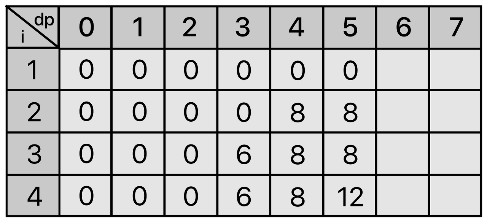

백준 12865번 평범한 배낭  
이 문제는 아주 평범한 배낭에 관한 문제이다.
한 달 후면 국가의 부름을 받게 되는 준서는 여행을 가려고 한다. 세상과의 단절을 슬퍼하며 최대한 즐기기 위한 여행이기 때문에, 가지고 다닐 배낭 또한 최대한 가치 있게 싸려고 한다.
준서가 여행에 필요하다고 생각하는 N개의 물건이 있다. 각 물건은 무게 W와 가치 V를 가지는데, 해당 물건을 배낭에 넣어서 가면 준서가 V만큼 즐길 수 있다. 아직 행군을 해본 적이 없는 준서는 최대 K만큼의 무게만을 넣을 수 있는 배낭만 들고 다닐 수 있다. 준서가 최대한 즐거운 여행을 하기 위해 배낭에 넣을 수 있는 물건들의 가치의 최댓값을 알려주자.  

입력형식  
첫 줄에 물품의 수 N(1 ≤ N ≤ 100)과 준서가 버틸 수 있는 무게 K(1 ≤ K ≤ 100,000)가 주어진다.   
두 번째 줄부터 N개의 줄에 거쳐 각 물건의 무게 W(1 ≤ W ≤ 100,000)와 해당 물건의 가치 V(0 ≤ V ≤ 1,000)가 주어진다.  
입력으로 주어지는 모든 수는 정수이다.  
출력형식  
한 줄에 배낭에 넣을 수 있는 물건들의 가치합의 최댓값을 출력한다.  

입력예제  
4 7  
6 13  
4 8  
3 6  
5 12  
출력예제  
14  

키워드 : 배낭문제라고 하는 유명한 문제로써 짐을 쪼갤 수 있는 경우와 짐을 쪼갤 수 없는 경우가 있다.  
짐을 쪼갤 수 있는 경우는 그리디 알고리즘을 이용하여 풀이할 수 있으며, 쪼갤 수 없는 경우는 DP를 이용하여 풀이할 수 있다.  
이러한 문제의 경우는 주어진 짐의 갯수와 짐의 크기로하는 2차원 표를 만들어 채워나가면서 점화식을 세울 수 있다.   
주어진 짐의 무게와 가치 : (6, 13), (4, 8), (3, 6), (5, 12)  
  
처음 무게가 2일때 까지는 주어진 짐으로 채울 수 없기 때문에 0으로 채운다.  

  
무게가 3일 경우는 주어진 짐의 무게가 3이고 가치가 6인 짐으로 채울 수 있으므로 짐의 인덱스인 3부터 채울 수 있으며 다음 인덱스는 이전의 인덱스 값보다 클 경우 갱신한다.  

  
이런식으로 무게가 5일 경우 가치가 8인 짐으로 채워지다가 마지막에 무게가 5이고 가치가 12인 짐을 채울 수 있으므로 갱신한다.  

  
i=2일 때 짐의 무게는 4이고 가치는 8이다. 무게가 7이므로 짐의 무게인 4를 뺀 후 남은 3의 무게에 대한 이전 i값은 빨간색 네모의 0이다.  
그러므로 8의 가치를 가지는데 이전의 가치가 13이었으므로 갱신되지 않는다.  

  
i=3일 때 짐의 무게는 3이고 가치는 6이다. 무게가 7이므로 짐의 무게인 3을 뺀 후 남은 4의 무게에 대한 이전 i값은 무게가 4일 때 i=2일 때 값  
빨간색 네모의 8이다. 그러므로 6+8 = 14의 가치를 갖게된다. 이전의 가치가 13이었으므로 갱신되서 14를 저장한다.  

이러한 반복되는 과정을 통해 점화식을 세우면 아래와 같이 세울 수 있다.  
  

바텀업 방식을 이용하여 반복문을 통해 문제를 풀이할 수 있다. 개선된 풀이를 하기 위해서는 0으로 채워지는 불필요한 과정을 진행하지 않기 위해서  
반복문을 j=k부터 시작해서 j-짐의 무게 >= 0일때까지만 j--를 진행하여 실행속도를 단축시킬 수 있다.