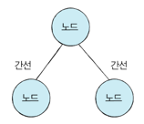
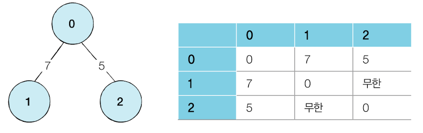
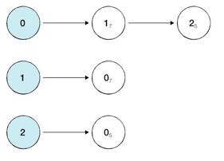
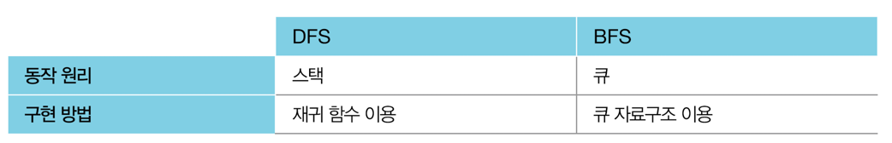
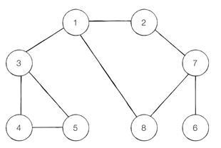
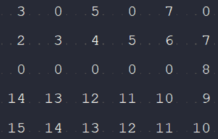

탐색이란 많은 양의 데이터 중에서 원하는 데이터를 찾는 과정을 의미한다. 프로그래밍에서는 그래프, 트리 등의 자료구조안에서  
탐색을 하는 문제를 자주 다룬다.  
◎ 대표적인 탐색 알고리즘 : DFS, BFS  
  
⭐️⭐️⭐️⭐️⭐️⭐️⭐️⭐️⭐️⭐️⭐️⭐️⭐️⭐️⭐️⭐️⭐️⭐️⭐️⭐️⭐️⭐️⭐️⭐️⭐️⭐️⭐️⭐️⭐️⭐️⭐️⭐️⭐️⭐️⭐️⭐️⭐️⭐️⭐️⭐️⭐️⭐️⭐️⭐️  
DFS : 깊이 우선 탐색이라고도 부르며, 그래프에서 깊은 부분을 우선적으로 탐색하는 알고리즘이다.  
그래프는 노드(Node)와 간선(Edge)으로 표현되며 이때 노드를 정점(Vertex)이라고도 말한다.  
  
프로그래밍에서 그래프는 크게 2가지 방식으로 표현할 수 있다.  
1. 인접 행렬(Adjacency Matrix) : 2차원 배열로 그래프의 연결 관계를 표현하는 방식  

```
    //DFS의 2차원 리스트를 이용한 인접 행렬 표현 방식
    //노드간의 거리를 저장
    private static int[][] graph = {
        {0, 7, 5},
        {7, 0, INF},
        {5, INF, 0}
    };
```
2. 인접 리스트(Adjacency List) : 리스트로 그래프의 연결 관계를 표현하는 방식  
  
``` 
    // 행(Row)이 3개인 인접 리스트 표현
    private static ArrayList<ArrayList<Node>> graph = new ArrayList<ArrayList<Node>>();
    
    // 그래프 초기화
    for(int i = 0; i < 3; i++) {
        graph.add(new ArrayList<Node>());
    }

    // 노드 0에 연결된 노드 정보 저장 (노드, 거리)
    graph.get(0).add(new Node(1, 7));
    graph.get(0).add(new Node(2, 5));

    // 노드 1에 연결된 노드 정보 저장 (노드, 거리)
    graph.get(1).add(new Node(0, 7));

    // 노드 2에 연결된 노드 정보 저장 (노드, 거리)
    graph.get(2).add(new Node(0, 5));
```

두 방식의 차이 : 메모리 측면에서 봤을 때 인접 행렬 방식은 모든 관계를 저장하므로 노드 개수가 많을수록 메모리가  
불필요하게 낭비된다. 반면에 인접 리스트 방식은 연결된 정보만을 저장하기 때문에 메모리를 효율적으로 사용한다.  
하지만 인접리스트 방식은 인접 행렬 방식과 달리 연결된 데이터를 하나씩 확인해야 하기 때문에 특정한 두 노드가 연결되어 있는지에  
대한 정보를 얻는 속도가 느리다.

DFS는 스택 자료구조를 이용하며 구체적인 동작 과정은 다음과 같다.  
1. 탐색 시작 노드를 스택에 삽입하고 방문 처리를 한다.  
2. 스택의 최상단 노드에 방문하지 않은 인접 노드가 있으면 그 인접 노드를 스택에 넣고 방문 처리를 한다. 방문하지 않은 인접  
없으면 스택에서 최상단 노드를 꺼낸다.
3. 2번의 과정을 더 이상 수행할 수 없을 때까지 반복한다.


BFS : 너비 우선 탐색이라고도 부르며, 가까운 노드부터 탐색하는 알고리즘이다. 최대한 멀리 있는 노드를 우선으로 탐색하는  
DFS와는 반대이다. BFS 구현에서는 선입선출 방식인 큐 자료구조를 이용하는 것이 정석이다. 인접한 노드를 반복적으로 큐에 넣도록  
알고리즘을 작성하면 자연스럽게 먼저 들어온 것이 먼저 나가게 되어, 가까운 노드부터 탐색을 진행하게 된다.  

BFS는 큐 자료구조를 이용하며 구체적인 동작 과정은 다음과 같다.  
1. 탐색 시작 노드를 큐에 삽입하고 방문 처리를 한다.
2. 큐에서 노드를 꺼내 해당 노드의 인접 노드 중에서 방문하지 않은 노드를 모두 큐에 삽입하고 방문 처리를 한다.
3. 2번의 과정을 더 이상 수행할 수 없을 때까지 반복한다.  



------------------------------------------------------------------------------------------------------------------

5-8번 DFS 예제  
  
위의 그래프에서 노드 1을 시작 노드로 설정하여 DFS를 이용해 탐색을 진행한다. 또한 인접한 노드 중에서 방문하지 않은 노드가  
여러 개 있으면 번호가 낮은 순서부터 처리한다.  
키워드 : DFS는 스택 자료구조에 기초한다. 그러므로 실제 구현은 재귀 함수를 이용했을 때 매우 간결하게 구현할 수 있다.  

실제로는 스택을 쓰지 않아도 되며 탐색을 수행함에 있어서 데이터의 개수가 N개인 경우 O(N)의 시간이 소요된다.  
방문한 노드와 방문하지 않은 노드를 구분하기 위해 방문된 정보를 리스트 자료형(boolean)으로 표현한다.  

------------------------------------------------------------------------------------------------------------------

5-9번 BFS 예제  
  
위의 그래프에서 노드 1을 시작 노드로 설정하여 BFS를 이용해 탐색을 진행한다. 또한 인접한 노드 중에서 방문하지 않은 노드가  
여러 개 있으면 번호가 낮은 순서부터 처리한다.  
키워드 : BFS는 큐 자료구조에 기초한다. 파이썬에서는 deque 라이브러리를 사용하는 것이 좋지만 java에서는 LinkedList를 활용한다.  

탐색을 수행함에 있어서 데이터의 개수가 N개인 경우 O(N)의 시간이 소요된다.  
일반적인 경우 실제 수행 시간은 DFS보다 좋은 편이다.  

------------------------------------------------------------------------------------------------------------------

5-10번 음료수 얼려 먹기  
N과 M을 입력받고 N x M의 배열을 생성한 후에 N x M 배열을 0과 1로 입력받는다. 구멍이 뚫려있는 부분은 0, 칸막이가 존재하는  
부분은 1로 표시된다. 구멍이 뚫려있는 부분은 상하좌우 서로 연결되어 있는 것으로 간주한다. 이때의 얼음틀에서 생성되는 아이스크림의  
갯수를 구하여라.  
키워드 : DFS를 이용하여 특정 지점을 순회하여 구할 수 있다.  

범위를 벗어나는 지점은 false를 리턴하고 0으로 되어 있는 지점을 순회하면서 상하좌우를 재귀적으로 호출하여 true를 리턴한다.  
한 묶음을 순회할 때마다 result를 하나씩 증가시켜 값을 구한다.

------------------------------------------------------------------------------------------------------------------

5-11번 미로탈출  
N과 M을 입력받고 N x M의 배열을 생성한 후에 N x M 배열을 0과 1로 입력받는다. 처음 위치는 1,1로 고정이고 탈출구는  
N,M으로 고정이다. 한번에 한칸씩 이동가능하며 괴물이 있는 부분은 0, 없는 부분은 1로 표시되어 있도록 배열을 입력받는다.  
이때 미로를 탈출하기 위한 최소칸의 갯수를 구하여라.  
키워드 : BFS와 predecessor를 이용해서 최단거리를 구할 수 있다.  

상,하,좌,우로 이동할 수 있으므로 dx,dy리스트를 만들어 이동할 수 있는 이동방향을 설정할 수 있도록 한다.  
BFS를 활용하여 count를 세면 모든 노드 방문횟수를 카운트하므로 이전노드의 거리값에 +1을 해서 BFS탐색을 끝내고  
탈출구의 값을 반환하면 된다. => array[nx][ny] = array[x][y] + 1; 이전노드의 값에 +1을 해가면서 도착지에 도달할 때  
값을 출력하면 최단거리를 구할 수 있다.  
  
이와 같이 도착지의 값을 출력할 수 있다.