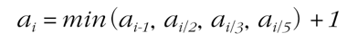
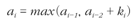
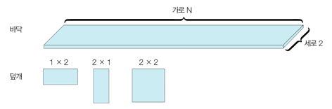

다이나믹 프로그래밍(Dynamic Programming) DP : 메모리 공간을 약간 더 사용하면서 연산 속도를 비약적으로 증가시킬 수 있는 방법  
DP를 사용할 수 있는 경우  
1. 큰 문제를 작은 문제로 나눌 수 있다.  
2. 작은 문제에서 구한 정답은 그것을 포함한 큰 문제에서도 동일하다. 

대표문제 : 피보나치 수열  

메모제이션 기법 : 다이나믹 프로그래밍을 구현하는 방법 중 한 종류로. 한 번 구한 결과를 메모리 공간에 메모해두고 같은 식을 다시 호출하면   
메모한 결과를 그대로 가져오는 기법  => 탑다운 방식에 국한되어 있다.  

다이나믹 프로그래밍의 전형적인 형태는 바텀-업 방식이다.

--------------------------------------------------------------------------------------------------------------------------------  

DP를 활용한 재귀피보나치수열  
기존의 피보나치수열을 재귀함수를 이용하여 풀이할 때는 동일한 함수가 반복적으로 호출되어 시간복잡도가 증가되었다.   
  
위의 그림처럼 중복된 노드를 방문하게 되어 효율적이지 못하다.  
시간복잡도는 O(2^N)이다.

메모제이션 기법을 활용하여 풀이를 하면 이미 구했던 답을 저장해두고 필요하면 다시 쓸 수 있기 때문에 시간복잡도를 줄일 수 있다.  
  
이와 같이 메모제이션을 활용하면 시간복잡도는 O(N)이다.  

재귀적으로 다이나믹 프로그래밍 소스코드를 작성하는 방식을 탑-다운 방식(하향식)이라고 한다.  

--------------------------------------------------------------------------------------------------------------------------------  

DP를 활용한 반복피보나치수열  
기존의 피보나치수열을 반복문을 이용하여 풀이하는 방법  

반복적으로 다이나믹 프로그래밍 소스코드를 작성하는 방식을 바텀-업 방식(상향식)이라고 한다.

--------------------------------------------------------------------------------------------------------------------------------  

1로 만들기  
정수 X가 주어질 때 정수 X에 사용할 수 있는 연산은 다음과 같이 4가지이다.  
1. X가 5로 나누어떨어지면, 5로 나눈다.
2. X가 3으로 나누어떨어지면, 3으로 나눈다.
3. X가 2로 나누어떨어지면, 2로 나눈다.
4. X에서 1을 뺀다.  
정수 X가 주어졌을 때, 연산 4개를 적절히 사용해서 1을 만들려고 한다. 연산을 사용하는 횟수의 최솟값을 출력하시오.  

입력형식  
첫째 줄에 정수 X가 주어진다.(1 <= X <= 30_000)  
출력형식  
첫째 줄에 연산을 하는 횟수의 최솟값을 출력한다.  

입력예제  
26  
출력예제  
3  

키워드 : DP를 이용하여 1로 만드는 횟수를 처음부터 저장하고 저장된 값을 이용하여 현재 값을 1로 만드는 횟수를 저장한다.  
반복문을 이용하여 2부터 시작해서 X값 까지 반복하면서 1로 만드는 횟수를 저장해야 한다.  
1. 배열의 이전 인덱스에는 1로 만드는 최소횟수가 저장되어 있다.
2. 배열의 이전 인덱스 값에 +1을 한다. => 현재 값에서 1을 뺀 연산을 한번 했기 때문에 이전 인덱스 값에 +1을 한것이다.
3. 현재 값이 2로 나눠 떨어지면 현재 인덱스를 2로 나눈 값에 +1을 한다.
=> ex) 현재 값이 8이라면 4는 8에서 2로 나눈 연산을 한번 했기 때문이다.
4. 1을 뺀 연산을 한 결과와 2로 나눈 연산을 한 결과를 비교하여 더 작은 값을 저장한다.  
=> 연산 횟수의 최솟값을 구해야 하므로 1을 뺀 연산과 나눈 연산 중 연산을 더 적게 하는 경우를 저장해야 하기 때문이다.
5. 3으로 나눠 떨어지는 경우와 5로 나눠 떨어지는 경우도 위와 마찬가지로 비교하면서 저장한다.  

이처럼 X까지 반복하면 이전의 값을 이용하여 1로 만드는 최소 횟수를 저장할 수 있다.  

이 문제의 점화식은 아래와 같다.  
  
+1은 이전의 값들의 최소횟수에서 4가지 방식의 연산 중 한 가지를 했기 때문에 1을 더해준 것이다.

--------------------------------------------------------------------------------------------------------------------------------  

개미전사  
메뚜기 정찰병들은 일직선상에 존재하는 식량창고 중에서 서로 인접한 식량창고가 공격받으면 바로 알아챌 수 있다. 따라서 개미 전사가 정찰병에게  
들키지 않고 식량창고를 약탈하기 위해서는 최소한 한 칸 이상 떨어진 식량창고를 약탈해야 한다. 예를 들어 식량창고 4개가 다음과 같이 존재한다고 가정하자.  
{1, 3, 1, 5}  
이때 개미 전사는 두 번째 식량창고와 네 번째 식량창고를 선택했을 때 최댓값인 총 8개의 식량을 빼앗을 수 있다. 개미 전사는 식량 창고가 이렇게 일직선상일 때  
최대한 많은 식량을 얻기를 원한다. 개미 전사를 위해 식량창고 N개의 정보가 주어졌을 때 얻을 수 있는 식량의 최댓값을 구하는 프로그램을 작성하시오.  

입력형식  
첫째 줄에 식량창고의 개수 N이 주어진다.(3 <= N <= 100)  
둘째 줄에 공백으로 구분되어 각 식량창고에 저장된 식량의 개수 K가 주어진다.(0 <= K <= 1_000)  
출력형식  
첫째 줄에 개미 전사가 얻을 수 있는 식량의 최댓값을 출력하시오.  

입력예제  
4  
출력예제  
1 3 1 5  

키워드 : DP를 이용하여 풀이가 가능하다. 최대의 식량을 갯수를 저장하는 배열을 하나 더 생성하여 왼쪽부터 차례대로 식량창고를 턴다고 가정하고  
점화식을 세워 풀이할 수 있다. 

최대 식량갯수를 저장하는 배열은 0번째에는 식량창고의 0번째의 값을 그대로 가져와야 하고 1번째 인덱스는 식량창고의 0번째와 1번째 중 큰값을 저장한다.  
ex) 3 1 1 5 로 식량창고가 채워져 있을 경우  
0번째 인덱스 + 3번째 인덱스가 1번째 인덱스 + 3번째 인덱스 보다 크다. 이럴 경우 두칸을 건너띄고 더하는게 더 큰 수를 얻을 수 있다.  
이렇게 0번째와 1번째 인덱스를 저장하고 2번째 인덱스 부터는 점화식을 이용하여 바텀업 방식의 반복문을 통해 구할 수 있다.  
  
a(i-1)은 최대의 식량 갯수 배열의 바로 앞의 인덱스이다. 바로 앞의 인덱스를 선택할 경우 현재 인덱스의 식량창고는 선택할 수 없으므로 a(i-1)만 고르고  
a(i-2)는 최대의 식량 갯수 배열의 두단계 앞의 인덱스이다. 이 경우는 현재 인덱스의 식량창고를 선택할 수 있으므로 a(i-1) + K(i)를 저장한다.  
둘 중 큰값을 저장하면 최대의 식량 갯수 배열은 현재 인덱스에서 얻을 수 있는 최대의 식량 값을 저장해 나갈 수 있다.  
제일 마지막 인덱스의 값을 출력하면 약탈 할 수 있는 최대의 식량갯수를 얻을 수 있다.

--------------------------------------------------------------------------------------------------------------------------------  

바닥공사  
가로의 길이가 N, 세로의 길이가 2인 직사각형 형태의 얇은 바닥이 있다. 태일이는 이 얇은 바닥을 1 x 2의 덮개, 2 x 1의 덮개, 2 x 2의 덮개를 이용해 채우고자 한다.  
  
이때 바닥을 채우는 모든 경우의 수를 구하는 프로그램을 작성하시오. 예를 들어 2 x 3 크기의 바닥을 채우는 경우의 수는 5가지이다.  

입력형식  
첫째 줄에 N이 주어진다. (1 <= N <= 1_000)  
출력형식  
첫째 줄에 2 x N 크기의 바닥을 채우는 방법의 수를 796_796으로 나눈 나머지를 출력한다.  

입력예제  
3  
출력예제  
5  

키워드 : DP를 이용해서 푸는 기초예제 중 하나인 타일링 문제 유형이다. 다이나믹 프로그래밍 문제에서는 종종 결과를 어떤 수로 나눈 결과를 출력하라는  
내용이 들어가 있는 경우가 많다. => 이때는 DP를 이용해서 풀어볼 것을 시도한다.  

DP를 이용해서 풀어야 한다면 점화식을 세워야한다. 왼쪽부터 덮개를 채우는 경우를 생각한다.  
한칸을 채워야 한다면 2 x 1 덮개 하나를 채우는 경우밖에 없다.  
두칸을 채워야 한다면 1 x 2 덮개 두개를 채우는 경우와 2 x 2 덮개 하나를 채우는 경우 총 2가지가 있다.  
이를 이용해 점화식을 세운다면 a(i) = a(i-1) + 2 * a(i-2)로 표현하고 i를 증가 시켜나가며 i에 맞는 경우의 수를 저장한다.  
