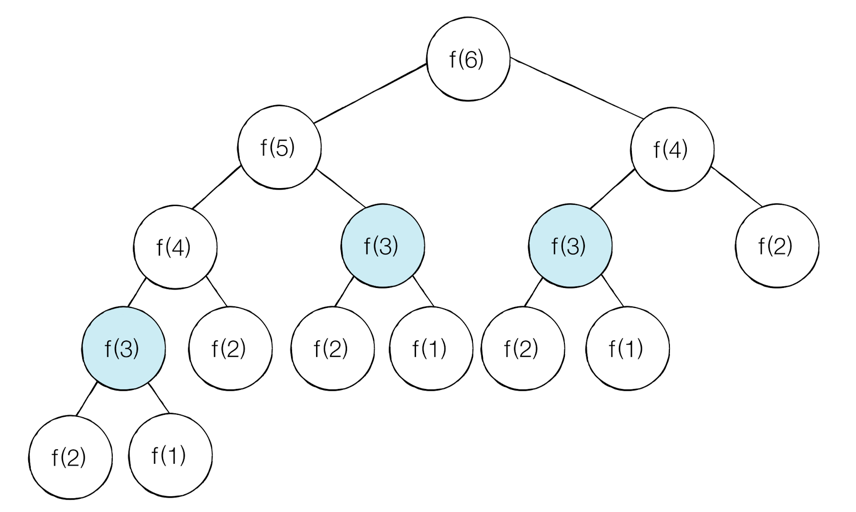
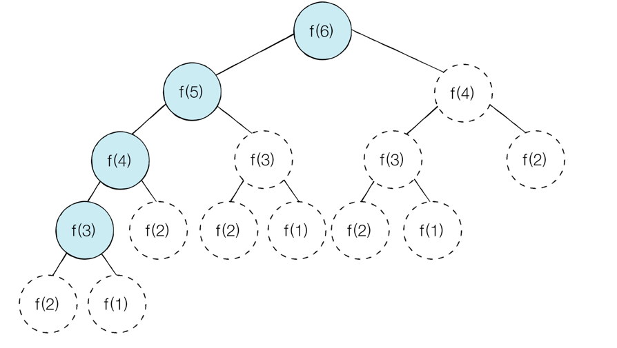

다이나믹 프로그래밍(Dynamic Programming) DP : 메모리 공간을 약간 더 사용하면서 연산 속도를 비약적으로 증가시킬 수 있는 방법  
DP를 사용할 수 있는 경우  
1. 큰 문제를 작은 문제로 나눌 수 있다.  
2. 작은 문제에서 구한 정답은 그것을 포함한 큰 문제에서도 동일하다. 

대표문제 : 피보나치 수열  

메모제이션 기법 : 다이나믹 프로그래밍을 구현하는 방법 중 한 종류로. 한 번 구한 결과를 메모리 공간에 메모해두고 같은 식을 다시 호출하면   
메모한 결과를 그대로 가져오는 기법  

--------------------------------------------------------------------------------------------------------------------------------  

DP를 활용한 피보나치수열  
기존의 피보나치수열을 재귀함수를 이용하여 풀이할 때는 동일한 함수가 반복적으로 호출되어 시간복잡도가 증가되었다.   
  
위의 그림처럼 중복된 노드를 방문하게 되어 효율적이지 못하다.  
시간복잡도는 O(2^N)이다.

메모제이션 기법을 활용하여 풀이를 하면 이미 구했던 답을 저장해두고 필요하면 다시 쓸 수 있기 때문에 시간복잡도를 줄일 수 있다.  
  
이와 같이 메모제이션을 활용하면 시간복잡도는 O(N)이다.