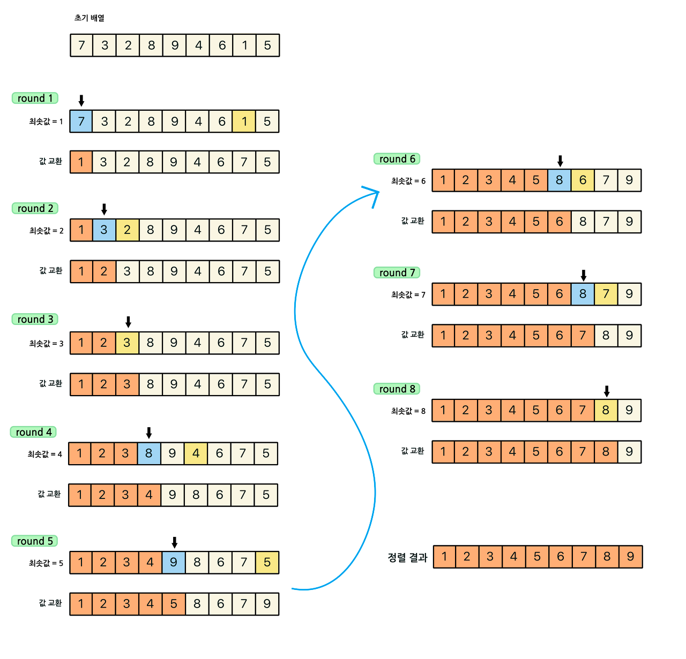
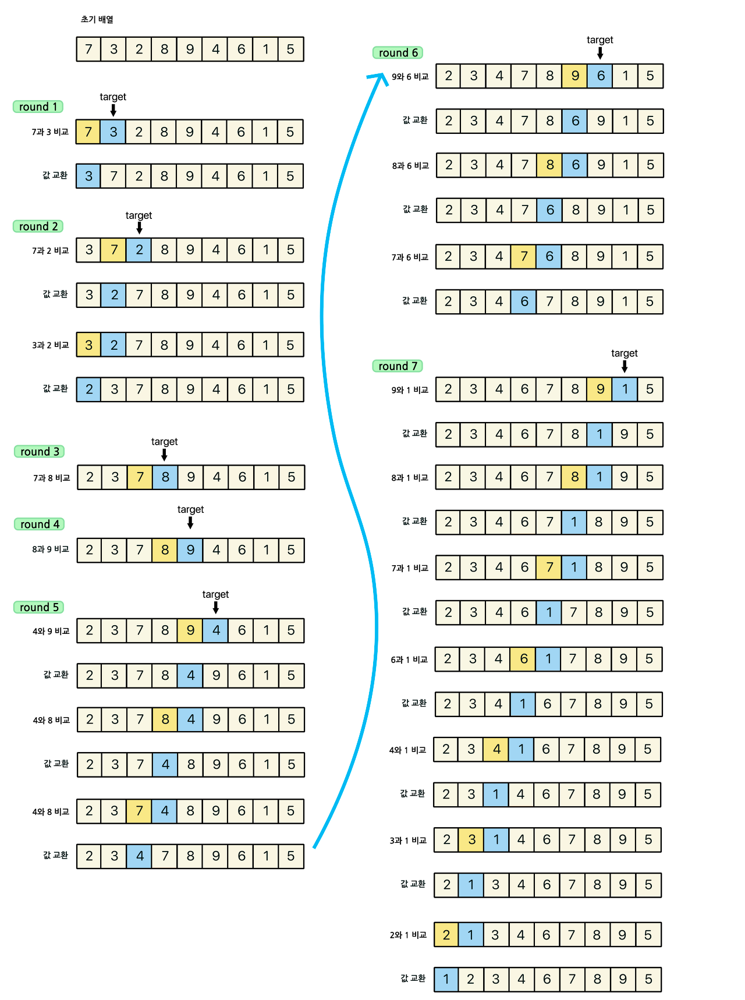
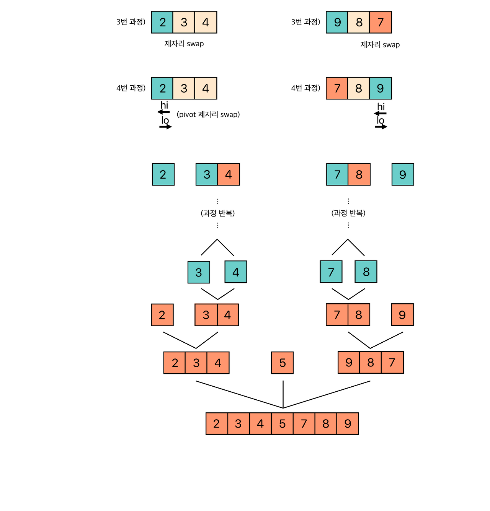
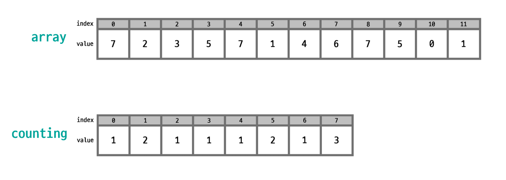

정렬이란 데이터를 특정한 기준에 따라서 순서대로 나열하는 것이다. 정렬을 통해 이진 탐색을 할 수 있다.  

선택정렬(Selection Sort) : 가장 작은 데이터를 선택해 맨 앞에 있는 데이터와 바꾸고, 그다음 작은 데이터를 선택해 앞에서 두 번째 데이터와 바꾸는 과정을 반복한다.  
  
⭐️주의할점 ⭐   
제일 마지막의 숫자는 비교할 필요가 없이 무조건 제일 큰 수 이므로 데이터 수 - 1 까지만 반복한다.  
선택정렬은 n-1번 만큼 가장 작은 수를 찾아서 맨 앞으로 보낸다. 시간 복잡도는 O(N^2)이다. 데이터가 많을 경우 속도가 느리므로 비효율적이다.  

------------------------------------------------------------------------------------------------------------------------

삽입정렬(Insertion Sort) : 특정한 데이터를 적절한 위치에 삽입한다.  
  
⭐️주의할점 ⭐  
첫번째 원소는 정렬되어 있다고 생각하기 때문에 인덱스 1부터 반복한다. 비교할 값을 한 칸씩 왼쪽으로 이동해가며 비교하므로 1까지 줄어들도록  
반복해야 0번째 인덱스와 1번째 인덱스를 비교한다. 0까지 줄어들면서 반복하면 ArrayIndexOutOfBoundsException가 발생한다.  
삽입정렬의 시간 복잡도는 O(N^2)인데 데이터가 거의 정렬되어 있는 상태라면 매우 빠르게 동작한다. 최선의 시간 복잡도는 O(N)이다.  

------------------------------------------------------------------------------------------------------------------------

퀵정렬(Quick Sort) : 기준을 설정한 다음 큰 수와 작은 수를 교환한 후 리스트를 반으로 나누는 방식으로 동작한다.  
기준(pivot)을 선택하는 방법에는 왼쪽 기준, 오른쪽 기준, 중앙 기준이 있다. 주로 많이 다루는 왼쪽 기준으로 피벗을 설정하였다.  
  
⭐️주의할점 ⭐  
피벗을 기준으로 왼쪽과 오른쪽에서 탐색을 진행해 풀이 방법에 맞게 반복문을 진행한다. left <= end && array[pivot] >= array[left] 이와 같은  
반복문을 실행한다. left <= end 조건을 array[pivot] >= array[left] 조건보다 먼저 두지 않으면 마지막 비교할 때 left의 값이 배열크기의 값보다  
커지므로 ArrayIndexOutOfBoundsException가 발생할 수 있다. 그러므로 left <= end 조건을 먼저 비교해 while문을 탈출한다.  
그리고 left <= right 조건이 불충족 될 경우는 분할이 된 경우이므로 분할된 기준으로 왼쪽과 오른쪽 데이터에 대해서 퀵정렬을 재귀호출 한다.  
이때 왼쪽 데이터 정렬은 0부터 분할데이터 -1 까지 정렬을 계속해서 진행하고 오른쪽 데이터 정렬은 분할데이터 +1부터 데이터크기(n)까지 정렬을 한다.  
최종 탈출 조건은 리스트의 데이터 개수가 1개인 경우 탈출한다. 즉, 이미 정렬이 되어 있는것이므로 분할이 불가능하여 탈출하고 return하여 다음 재귀문을 호출한다.  
퀵정렬의 평균 시간 복잡도는 O(NlogN)이다. 최악의 경우는 O(N^2)이다.  
최악의 경우는 가장 왼쪽 데이터를 pivot로 삼을 때 가장 왼쪽 데이터가 이미 정렬되어 있는 경우이다. 삽입정렬과 반대이다.

------------------------------------------------------------------------------------------------------------------------

계수정렬(Count Sort) : 특정한 조건이 부합할 때만 사용할 수 있지만 매우 빠른 정렬 알고리즘  
계수정렬은 데이터의 크기 범위가 제한되어 정수 형태로 표현할 수 있을 때만 사용할 수 있다.  
일반적으로 가장큰 데이터와 가장 작은 데이터의 값의 차이가 1,000,000을 너지 않을 때 효과적으로 사용할 수 있다.  
  
⭐️주의할점 ⭐  
가장 큰 데이터의 값보다 +1 크기의 배열을 선언해줘야 하므로 가장 큰 데이터값을 알고 있어야 한다.  
계수정렬의 시간 복잡도는 O(N+K)이다. K=데이터중 최대값의 크기  
시간복잡도가 매우 우수하지만 가장 작은 데이터와 가장 큰 데이터의 차이가 크다면 공간 복잡도가 불필요하게 증가되어 비효율적일 수 있으므로 데이터의 범위가 한정되어 있을 경우 효과적이다.

------------------------------------------------------------------------------------------------------------------------

자바에서 객체정렬하는 방법 : Comparable 인터페이스에서 추상 메서드 compareTo를 재정의 하여 정렬하고자 하는 객체의 필드를 비교한다.  
compareTo메서드를 재정의 했다면 Arrays.sort()메서드를 통해 비교하고자 하는 필드로 정렬이 된다.

------------------------------------------------------------------------------------------------------------------------

위에서 아래로  
수열을 내림차순으로 출력하라.  

입력형식  
첫째줄에 수열의 크기 n을 입력받는다. 둘째줄부터 n+1번째줄까지 n개의 수가 입력된다.  
출력형식  
입력으로 주어진 수열을 내림차순으로 정렬된 결과를 공백으로 구분하여 출력한다.  

입력예제  
3  
15  
27  
12  
출력예제  
27 15 12  

키워드 : 기본정렬 라이브러리를 활용하다.  
Arrays.sort()메서드는 오름차순으로 정렬해주지만 Arrays.sort(배열, Collection.reverseOrder())를 활용하면 내림차순으로 정렬할 수 있다.  

------------------------------------------------------------------------------------------------------------------------

성적이 낮은 순서로 학생 출력하기  
N명의 학생 정보가 있다. 학생의 정보는 학생의 이름과 학생의 성적으로 구분된다. 각 학생의 이름과 성적이 주어졌을 때 성적이 낮은 순서대로  
학생의 이름을 출력하세요.  

입력형식  
첫 번째줄에 학생의 수 n을 입력받는다. 두 번째줄부터 n+1번째 줄까지 학생의 이름과 학생의 성적이 공백으로 구분되어 입력받는다.  
출력형식  
모든 학생의 이름을 성적이 낮은순서대로 공백으로 구분하여 출력하라. 성적이 동일한 경우는 자유롭게 출력해도 된다.  

입력예제  
2  
홍길동 95  
이순신 77  
출력예제  
이순신 홍길동  

키워드 : 학생의 정보를 담는 객체를 생성하여 조건에 맞게 객체를 점수에 대해 정렬한다.  
객체를 정렬할 경우에는 Comparable 인터페이스에서 compareTo()메서드를 재정의 해야한다.  
오름차순일 경우에는 자신의 값 < 상대의 값 일때 -1을 리턴하고 내림차순일 경우에는 자신의 값 > 상대의 값 일때 1을 리턴한다.