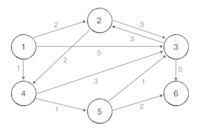

최단경로 알고리즘은 말 그대로 가장 짧은 경로를 찾는 알고리즘이다. 최단 경로 문제는 보통 그래프를 이용해 표현하는데 각 지점은 '노드'로 표현되고,  
지점간 연결된 도로는 그래프에서 '간선'으로 표현된다. 보통 최단 경로를 모두 출력하는 문제보다는 단순히 최단거리를 출력하도록 요구하는 문제가 많이 출제된다.  

최단거리 알고리즘의 대표적인 예는 다익스트라 최단경로, 플로이드 워셜, 벨만 포드 알고리즘 이렇게 3가지이다.  
최단경로 알고리즘에는 그리디 알고리즘과 다이나믹 프로그래밍 알고리즘이 적용된다.  

----------------------------------------------------------------------------------------------------------------------  

다익스트라 최단 경로 알고리즘 : 그래프에서 여러 개의 노드가 있을 때 특정한 노드에서 출발하여 다른 노드로 가는 최단 경로를 구해주는 알고리즘이다.  
기본적으로 그리디 알고리즘으로 분류된다. 매번 '가장 비용이 적은 노드'를 선택해서 임의의 과정을 반복하기 때문이다.  

동작원리  
1. 출발 노드를 설정한다.
2. 최단 거리 테이블을 초기화한다.
3. 방문하지 않은 노드 중에서 최단 거리가 가장 짧은 노드를 선택한다.
4. 해당 노드를 거쳐 다른 노드로 가는 비용을 계산하여 최단 거리 테이블을 갱신한다.
5. 위 과정에서 3번과 4번을 반복한다.  

초기상태에 모든 노드로 가는 최단 거리를 '무한'으로 초기화 한다. 출발하는 노드(1번)의 거리는 0으로 설정한다.  
   
   

1번 노드를 거쳐 다른 노드로 가는 비용을 계산한다. 즉, 연결된 모든 간선을 하나씩 확인한다.  
현재 1번 노드까지 오는 비용은 0이므로 연결된 노드의 간선길이에 0을 더한 값이 노드로 가는 비용이다.
   

이후 모든 단계에서 방문하지 않은 노드 중에서 최단 거리가 가장 짧은 노드를 선택해야 한다. 현재는 4번노드의 거리가 1로 가장 짧으므로 4번노드가 선택된다.  
4번 노드까지 오는 비용은 1이므로 연결된 노드의 간선길이에 1을 더한 값이 노드로 가는 비용이다. 기존의 거리보다 4번 노드를 거쳐 가는 비용이 더 적을 경우 갱신한다.  
   

방문하지 않은 노드 중에서 최단 거리가 가장 짧은 노드는 2번과 5번 노드인데 보통 숫자가 작은 노드부터 탐색하므로 2번 노드를 선택한다.  
2번 노드까지 오는 비용은 2이므로 연결된 노드 3번까지 거리 3 + 2 = 5 인데 기존의 3번노드 까지 거리는 4였으므로 갱신하지 않는다.  
연결된 4번 노드도 마찬가지로 4번까지 거리 2 + 2 = 4인데 기존의 4번노드 까지 거리는 1이므로 갱신하지 않는다.  
  
   

마찬가지로 다음 노드로 5번으로 이동하여 연결된 노드에 대해 비용을 갱신할 수 있다면 갱신한다.  
   

이후 3번 노드도 동일한 과정을 반복한다.  
   

마지막으로 6번 노드도 동일한 과정을 반복하고 최종 최단 거리 테이블은 다음과 같다.  
   

1번 노드로부터 출발했을 때 2번,3번,4번,5번,6번 노드까지 가기 위한 최단 경로가 각각 2,3,1,2,4라는 의미이다.  

다익스트라 알고리즘이 진행되면서 한 단계당 하나의 노드에 대한 최단 거리를 확실히 찾는 것이다.

간단한 다익스트라 알고리즘  
O(V^2)의 시간 복잡도를 가지며 V는 노드의 개수를 의미한다. 처음에 각 노드에 대한 최단 거리를 담는 1차원 리스트를 선언한다.  
이후에 단계마다 '방문하지 않은 노드 중에서 최단 거리가 가장 짧은 노드를 선택'하기 위해 매 단계마다 1차원 리스트의 모든 원소를 탐색한다.  

입력예제  
6 11  
1  
1 2 2  
1 3 5  
1 4 1  
2 3 3  
2 4 2  
3 2 3  
3 6 5  
4 3 3  
4 5 1  
5 3 1  
5 6 2  
출력예제  
0 2 3 1 2 4  

키워드 : 노드의 인덱스와 거리를 저장하기 위한 객체 Node를 생성한다. 각 노드에 연결되어 있는 노드에 대한 정보를 담기 위해 graph를 선언한다.  
graph는 ArrayList<ArrayList<Node>>로 생성하고 방문한 노드를 체크하는 boolean배열과 노드간 거리를 저장할 distance배열을 생성한다.  
초기 상태의 distance는 infinity로 초기화한다. graph를 노드개수+1 크기로 초기화하고 주어진 노드간의 연결 정보를 graph에 저장한다.  
시작 위치에서 연결된 노드들에 대해 입력받은 거리를 distance배열에 저장한다.  
시작노드를 제외한 노드들을 반복하면서 방문하지 않고 거리가 가장 짧은 노드로 이동한고 방문처리한다.  
기존의 distance에 저장된 거리보다 연결된 노드를 거쳐서 이동하는 거리가 더 짧을 경우 갱신하여 distance에 저장한다.  
반복문을 모두 마쳤을 때 distance배열에 최종 최단 거리가 저장되어 있으므로 출력할 수 있다.  

간단한 다익스트라 알고리즘은 최단 거리가 가장 짧은 노드를 매번 선형 탐색해야 하므로 시간 복잡도가 O(V^2)이다.  
전체 노드의 개수가 5_000개 이하라면 일반적으로 이 코드로 풀 수 있지만 노드의 개수가 10_000개를 넘어가는 문제라면 이 코드로 문제를 해결하기 어렵다.  

----------------------------------------------------------------------------------------------------------------------  

개선된 다익스트라 알고리즘 : 힙 자료구조를 사용하여 특정 노드까지의 최단 거리에 대한 정보를 힙에 담아서 처리하므로 출발 노드로 부터  
가장 거리가 짧은 노드를 더욱 빠르게 찾을 수 있다.  

동작원리  
다익스트라 알고리즘이 동작하는 기본원리는 전의 방법과 같고 현재 가장 가까운 노드를 저장하기 위한 목적으로만 우선순위 큐를 추가로 이용한다.  

초기상태에 모든 노드로 가는 최단 거리를 '무한'으로 초기화 한다. 출발하는 노드(1번)의 거리는 0으로 설정한다.
이후에 우선순위 큐에 1번 노드를 넣는다.  
  
  

우선순위 큐를 이용하고 있으므로 거리가 가장 짧은 노드를 선택하기 위해서는 우선순위 큐에서 그냥 노드를 꺼내면 된다.  
우선순위 큐에서 노드를 꺼낸 뒤에 해당 노드를 이미 처리한 적이 있다면 무시하면 되고 아직 처리하지 않은 노드에 대해서만 처리하면 된다.  
우선순위 큐에서 원소를 꺼내면 (0, 1)이 나온다. 이는 1번 노드까지 가는 최단 거리가 0이라는 의미이므로, 1번 노드를 거쳐서 연결된 2,3,4번 노드로 
가는 최소비용을 계산한다. 차례대로 (0+2), (0+5), (0+1)이다. 기존에 2,3,4번 노드로 가는 비용이 무한이었는데 더 짧은 경로를 찾았으므로 갱신한다.  
이렇게 더 짧은 경로를 찾은 노드 정보들은 다시 우선순위 큐에 넣는다.  
  

이어서 다시 우선순위 큐에서 원소를 꺼내서 동일한 과정을 반복한다. (1,4)의 값을 갖는 원소가 추출되고 최단거리를 계산하여 기존의 값들보다 작다면 
갱신하고 우선순위 큐에 갱신된 노드의 정보들을 넣는다.  
  

다시 우선순위 큐에서 원소를 꺼내면 (2,2)의 값을 갖는 원소가 추출되고 더 짧은 거리가 있다면 갱신하고 우선순위 큐에 삽입한다.  
하지만 더 짧은 거리가 없기 때문에 값이 갱신되지 않고 큐에 노드의 정보를 삽입하지 않는다.  
  

우선순위 큐에서 (2,5)의 원소가 추출되고 동일한 과정을 반복한다.  
  

우선순위 큐에서 (3,3)의 원소가 추출되고 동일한 과정을 반복한다.  
  

다음으로 우선순위 큐에서 (4,3)의 원소가 추출되는데 3번 노드는 이미 처리된 적이 있다. 그러므로 무시한다.  
  

우선순위 큐에서 (4,6)의 원소가 추출되고 동일한 과정을 반복한다.  
  

마지막으로 남은 원소를 꺼내면 (5,3)의 원소가 추출되는데 3번 노드는 이전에 처리된 적이 있으므로  무시한다. 큐가 비었다면 최종 최단 거리 테이블은 다음과 같다.  
  

개선된 다익스트라 알고리즘  
최악의 경우에도 시간 복잡도 O(ElogV)를 보장한다. V는 노드의 개수이고, E는 간선의 개수이다.    
우선순위 큐를 이용하여 우선순위가 가장 높은 데이터를 가장 먼저 삭제하는 방식을 택한 것이다.  

입력예제  
6 11  
1  
1 2 2  
1 3 5  
1 4 1  
2 3 3  
2 4 2  
3 2 3  
3 6 5  
4 3 3  
4 5 1  
5 3 1  
5 6 2  
출력예제  
0 2 3 1 2 4  

키워드 : 인덱스와 거리를 필드로 갖는 Node클래스를 만들고 Comparable 인터페이스를 구현하여 compareTo메서드를 거리가 짧은 것이 높은 우선순위를 갖도록 설정한다.  
기존의 다익스트라 알고리즘에서 선언한 것과 같이 각 노드에 연결되어 있는 노드에 대한 정보를 담기 위해 graph를 선언한다.  
초기 상태의 distance는 infinity로 초기화한다. graph를 노드개수+1 크기로 초기화하고 주어진 노드간의 연결 정보를 graph에 저장한다.  
시작 위치에서 연결된 노드들에 대해 입력받은 거리를 distance배열에 저장한다.  
우선순위 큐에 시작점과 거리를 0으로 하는 원소를 넣고 거리 리스트에 시작점의 거리를 0으로 저장한다.  
우선순위 큐가 비어있을 때까지 반복하며 우선순위 큐에서 원소를 꺼내 최단거리가 가장 짧은 노드를 구한다.  
우선순위 큐에서 꺼낸 원소의 거리가 거리 리스트에 저장된 값보다 크다면 이미 처리된 노드이므로 무시한다.(continue한다.)  
현재 노드와 연결된 모든 노드들을 확인하면서 기존의 distance에 저장된 거리보다 연결된 노드를 거쳐서 이동하는 거리가 더 짧을 경우  
갱신하여 distance에 저장하고 우선순위 큐에 노드의 정보를 삽입한다.  

